# Architectural Design

Project consists of the mathematical implementation of the backpropagation
algorithm in excel for a very simple two layered network architecture. The
section Mathematical Implementation of Back Propagation elaborates more on
this.

## Mathematical Implementation of Back Propagation

The mathematical implementation of back propagation was elaborated with a very
simple neural network with one hidden layer as shown in the Excel sheet.

The network was trained for about 66 epochs manually using the mathematical
formulations. The formulations are explained in the Excel sheet. 5 experiments
were conducted with varying learning rates starting from 0.1, 0.2, 0.5, 0.8,
1.0 and 2.0.

The results observed are shown in the images below with the output table and
the output loss graph.

### Learning rate = 0.1

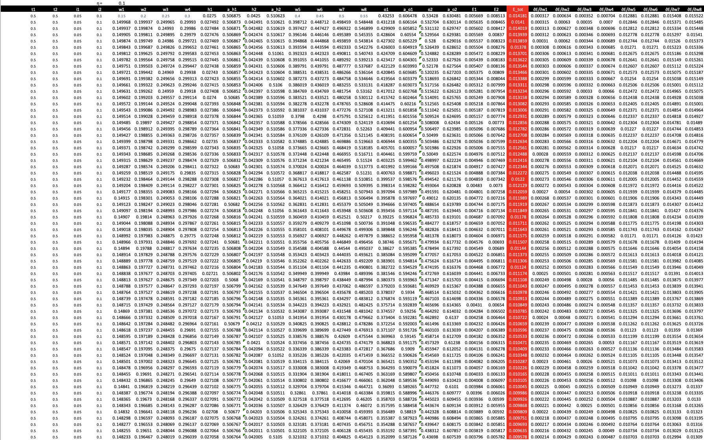{: style="height:200px"}
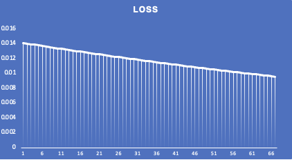{: style="height:200px"}

### Learning rate = 0.2

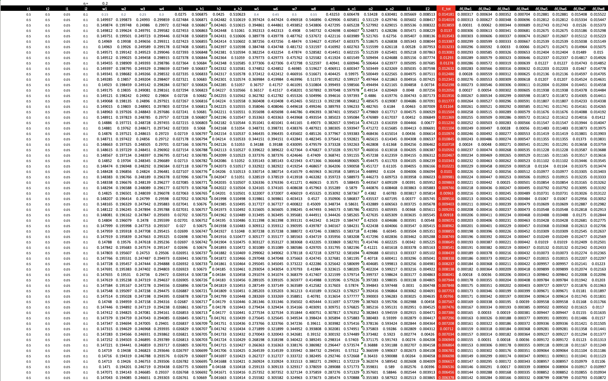{: style="height:200px"}
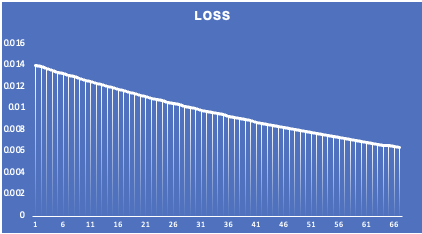{: style="height:200px"}

### Learning rate = 0.5

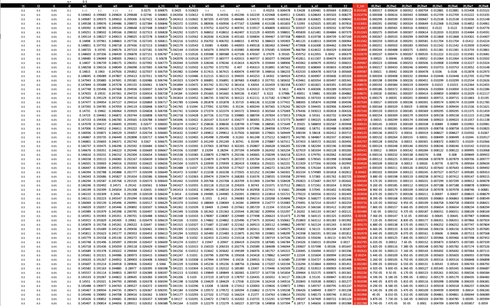{: style="height:200px"}
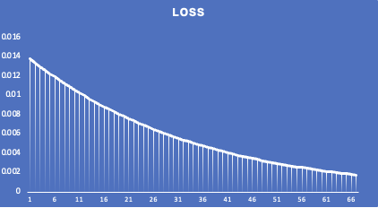{: style="height:200px"}

### Learning rate = 0.8

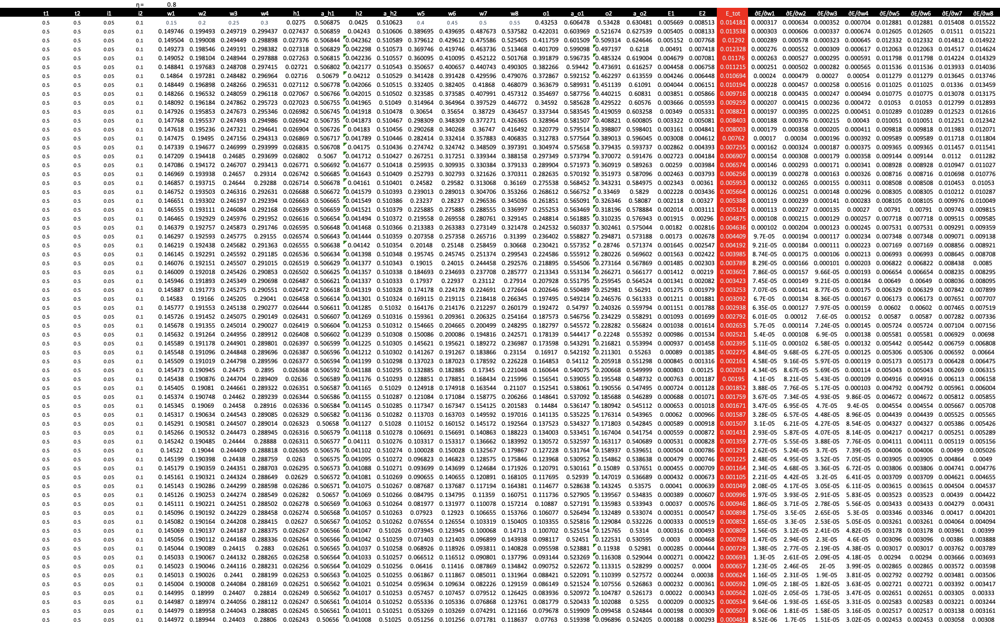{: style="height:200px"}
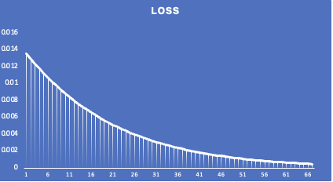{: style="height:200px"}

### Learning rate = 1.0

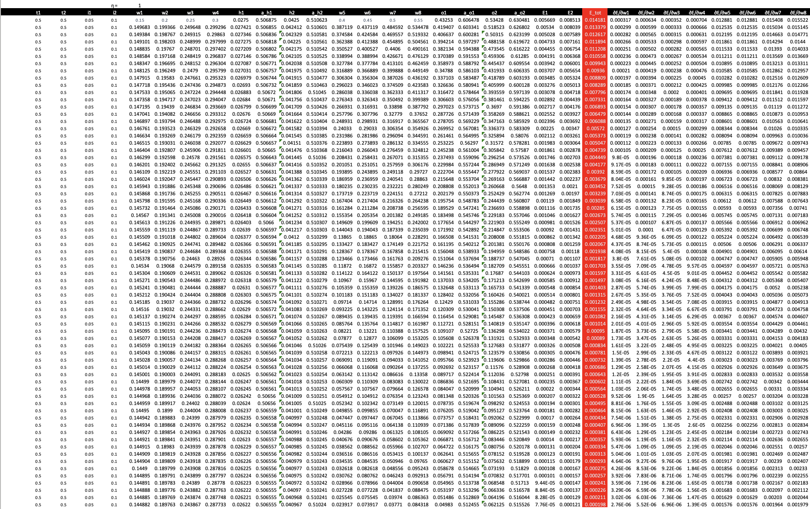{: style="height:200px"}
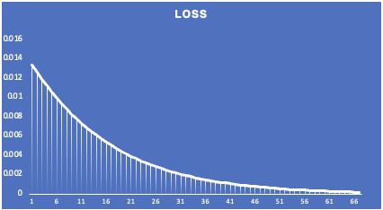{: style="height:200px"}

### Learning rate = 2.0

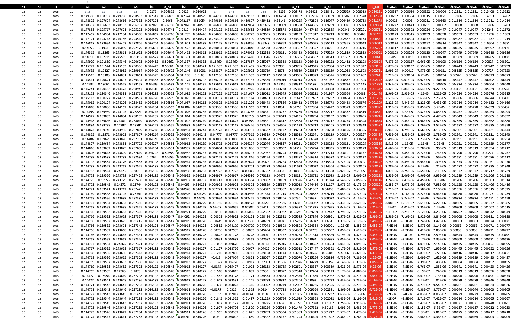{: style="height:200px"}
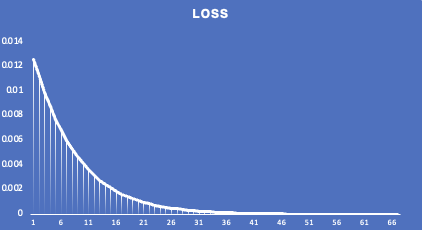{: style="height:200px"}

## Architectural Design to achieve 99.4% validation accuracy

The goal of the architecture design of the neural network is to optimize the
network architecture for achieving a validation accuracy of 99.4% on MNIST
dataset with less than 20,000 model parameters.

I explored three different model architectures, their performance and model
design aspects are tabulated below:

| Model Design Choice | Parameter Count | Best Accuracy | No. epochs > 99.4 |
| :-----------------: | :-------------: | :-----------: | :---------------: |
| With Dropout 0.05   | 15,186          | 99.60%        | 8 epochs          |
| without dropout     | 15,186          | 99.55%        | 11 epochs         |
| without dropout     | 3,998           | 99.40%        | 1 epoch           |
